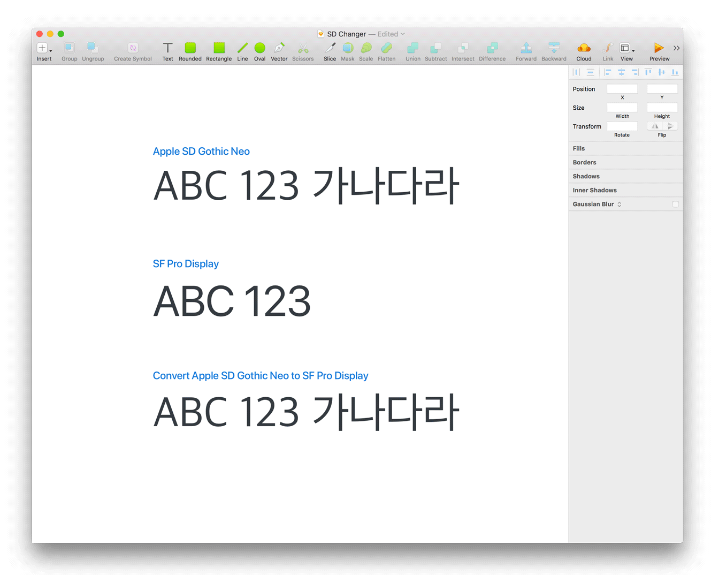

# SD Changer

SD Changer는 한국어로 언어 설정 된 iOS 화면을 더 쉽게 디자인 하도록, Apple SD Gothic Neo 폰트를 일괄로 SF Pro Display로 바꿔주는 Sketch plugin 입니다.

## Keys 

- Menu `Plugins` › `SD Changer`  
- Shortcut `shift` `option` `command` `D` 

## Features

선택된 레이어나 그룹, 아트보드 안의 Apple SD Gothic Neo 폰트가 적용된 텍스트 레이어를 찾아, SF Pro Display로 변환합니다. 아무것도 선택되지 않은 상태에서 작동하면 현재 Page의 모든 텍스트 레이어를 대상으로 합니다.

## Install

- [플러그인 파일](https://github.com/yeun/sd-changer/releases/latest)을 다운로드 받습니다.
- 압축을 풉니다.
- .sketchplugin 파일을 더블클릭해 설치합니다.